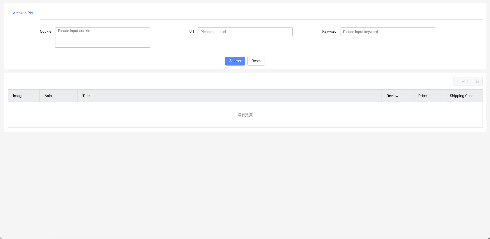

# Pick Data Tool

- This a web tool to get the amazone search list products properties that such as image url, detail url, title, asin number, review number, price, shipping cost.

# Features
- search and show data by keyword, url. If don't input the Cookie, the query logic will execute as default.
- download the table data and create the excel file at local
- example picture:
  

# Project Tech Structure
- Web Page
  - Webpack5
  - TypeScript
  - React v17
- Server
  - Node v17.3.0

# How to use
```
npm i 
npm run start
```


